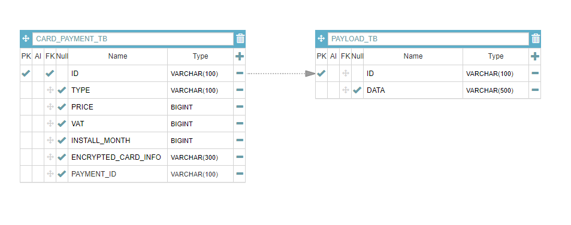

# card-payment-system
결제요청을 받아 카드사와 통신하는 인터페이스를 제공하는 결제 시스템
## INDEX
- 개발 프레임워크
- 테이블 설계
- 문제해결 전략
- 빌드 및 실행 방법
## 개발 프레임워크
- Java 11 (추후 Java 17로 변경 예정)
- Spring Boot 2.7.9 (추후 Spring Boot 3.0으로 변경 예정)
- Gradle - Groovy
- Spring Data JPA(Hibernate)
- H2 Database
## 테이블 설계
### ERD

## 문제해결 전략

## 빌드 및 실행 방법
