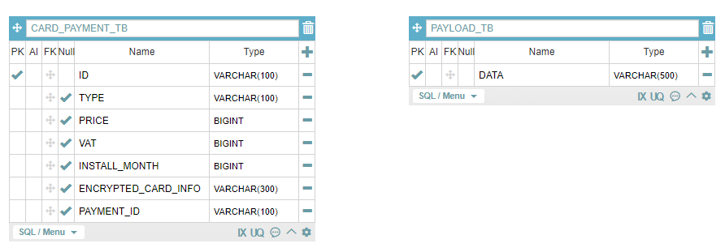

# card-payment-system
결제요청을 받아 카드사와 통신하는 인터페이스를 제공하는 결제 시스템
## INDEX
- 개발 프레임워크
- 테이블 설계
- API 정보
- 문제해결 전략
- 단위 테스트
- 빌드 및 실행 방법
## 개발 프레임워크
- Java 11 (추후 Java 17로 변경 예정)
- Spring Boot 2.7.9 (추후 Spring Boot 3.0으로 변경 예정)
- Gradle - Groovy
- Spring Data JPA(Hibernate)
- H2 Database
## 테이블 설계
### ERD


## API 정보
### 결제 API
- Request
```json
{
   "cardNo": 카드번호(10~16자리 숫자),
   "expiryDate": 유효기간(4자리 숫자, mmyy),
   "cvc": CVC(3자리 숫자),
   "installMonth": 할부개월수(0(일시불), 1~12),
   "price": 결제 금액(100원 ~ 10억 이하),
   "vat": 부가가치세(Optional)
}
```
- Response
```json
{
   "id": 관리번호(고유 ID, 20자리),
   "cardData": 카드사 전송 데이터
}
```
### 결제 취소 API
- Request
```json
{
   "id": 결제 관리번호(고유 ID, 20자리),
   "cancelPrice": 취소 금액,
   "vat": 부가가치세(Optional)
}
```
- Response
```json
{
   "id": 관리번호(고유 ID, 20자리) - 결체 취소에 대한 ID 별도 생성,
   "cardData": 카드사 전송 데이터
}
```
### 결제 조회 API
- Request
```json
{
   "id": 관리번호(결제 또는 취소에 대한)
}
```
- Response
```json
{
   "id": 관리번호,
   "cardInfo": {
      "cardNo": 카드번호(앞 6자리 및 뒤 3자리를 제외한 나머지를 Masking),
      "expiryDate": 유효기간,
      "cvc": CVC
   },
   "paymentType": 결제/취소 구분("PAYMENT" or "CANCEL"),
   "priceInfo": {
      "price": 결제/취소 금액,
      "vat": 부가가치세
   }
}
```

## 문제해결 전략
1. String 데이터
   - string 데이터 명세에 따라 데이터 포맷 변경
   ```java
   public static String onFormat(Object value, FieldInfo fieldInfo) {
        switch (fieldInfo.getType()) {
            case "NUMBER":
                return StringUtils.leftPad(String.valueOf(value), fieldInfo.getLength(), " ");
            case "NUMBER_0":
                return StringUtils.leftPad(String.valueOf(value), fieldInfo.getLength(), "0");
            case "NUMBER_L":
            case "STRING":
                return StringUtils.rightPad(String.valueOf(value), fieldInfo.getLength(), " ");
            default:
                throw new CustomException(ErrorCode.INVALID_FORMAT_TYPE);
        }
    }
   ```
   - StringBuffer를 사용해 카드사 데이터 조합(ThreadSafe)
   ```java  
     return new StringBuffer()
         .append(onFormat(Constants.DATA_LENGTH, FieldInfo.DATA_LENGTH))
         .append(onFormat(payment.getType(), FieldInfo.DATA_TYPE))
         .append(onFormat(payment.getId(), FieldInfo.ID))
         .append(onFormat(cardInfo.getCardNo(), FieldInfo.CARD_NUM))
         .append(onFormat(payment.getInstallMonth(), FieldInfo.INSTALL_MONTH))
         .append(onFormat(cardInfo.getExpiryDate(), FieldInfo.EXPIRY_DATE))
         .append(onFormat(cardInfo.getCvc(), FieldInfo.CVC))
         .append(onFormat(payment.getPrice(), FieldInfo.PRICE))
         .append(onFormat(payment.getVat(), FieldInfo.VAT))
         .append(onFormat((payment.getPaymentId() == null ? "" : payment.getPaymentId()), FieldInfo.PAYMENT_ID))
         .append(onFormat(payment.getCardInfo(), FieldInfo.ENCRYPTED_CARD_INFO))
         .append(onFormat("", FieldInfo.RESERVE_FIELD))
         .toString();
   ```
2. 부가가치세
   - 부가가치세를 입력받지 않은 경우 수식으로 자동 계산
   ```java
     public static Long calculateAutoVat(Long vat, Long price) {
        if (price != null) {
            return (vat != null) ? vat : Math.round(price / 11);
        } else {
            return vat;
        }
    }
   ```
3. 카드정보 암/복호화
   - javax.crypto.Cipher 라이브러리 사용
   - application.yaml 파일에 암호화 방식, 암호 키, 구분자 지정
   ```yaml
   card:
    cipher:
        algorithm: DESede
        secret-key: secretsecretsecretsecret
        separator: _
   ```
   - Init(Cipher 인스턴스 초기화), Encrypt(암호화), Decrypt(복호화) 함수 정의
     - CryptoUtil.java
     </br></br>
4. 트랜잭션 데이터 관리
   - RandomStringUtils를 사용하여 문자 & 숫자를 조합한 Unique 관리번호 생성
   ```java
   public static String generateUniqueId() {
        return RandomStringUtils.random(20, "0123456789abcdefghigklmnoprstuvwxyzABCDEFGHIGKLMNOPRSTUVWXYZ");
    }
   ```
   - Self Join을 통해 취소 데이터를 결제 데이터와 연결
   ```java
    @ManyToOne
    @JoinColumn(name = "PAYMENT_ID")
    private Payment paymentId;

    @OneToMany(mappedBy = "paymentId")
    private Set<Payment> payments;
   ```
   - 결제 취소시에도 고유 관리번호를 부여하여 조회 시 결제 및 취소 데이터 1건만 조회 됨
   ```java
   return Payment.builder()
                .id(DataHandlerUtil.generateUniqueId())
                .type(PaymentType.CANCEL.getValue())
                .price(request.getCancelPrice())
                .vat(request.getVat())
                .installMonth(0L) //취소시 할부개월수는 0
                .cardInfo(exPayment.getCardInfo())
                .paymentId(exPayment)
                .build();
   ```
5. Multi Thread 환경을 대비한 동시성 제어
   - Redis 분산 락을 사용
   - RedisConnectionFactory를 Bean으로 주입받아 LockUtil 생성자 생성
   ```java
   @Configuration
   public class LockConfig {
     @Bean
      public LockUtil lockUtil(RedisConnectionFactory connectionFactory) {
          return new LockUtil(connectionFactory, "info");
      }
   }
   ```
   ```java
   public LockUtil(RedisConnectionFactory connectionFactory, String registryKey) {
        this.registryKey = registryKey;
        this.lockRegistry = new RedisLockRegistry(connectionFactory, registryKey, 10000);
   }
   ```
   - 결제 및 취소 시 Unique한 정보(암호화된 카드 정보(결제) / 관리번호(취소))를 키 값으로 Lock 
   ```java
   if (!lockUtil.lock(encryptedCardInfo).tryLock()) {
            throw new CustomException(ErrorCode.LOCK_PAYMENT);
        }
   ```
   ```java
   if (!lockUtil.lock(cancelRequest.getId()).tryLock()) {
            throw new CustomException(ErrorCode.LOCK_CANCEL);
        }
   ```
   - 테스트 코드를 통한 동시성 제어 증명
      >- MultiThreadTest.java
6. 에러 코드 정의
```java
 UNEXPECTED_ERROR("E00", "Unexpected Error"),

 INVALID_PARAM_OMITTED("E01", "누락된 입력 값이 존재합니다."),
 INVALID_VAT_CANCEL("E02", "취소 부가가치세는 남은 부가가치세보다 클 수 없습니다."),
 INVALID_VAT_PRICE("E03", "부가가치세는 결제 금액보다 클 수 없습니다."),
 INVALID_CANCEL_PRICE("E04", "취소 금액은 남은 결제 금액 보다 클 수 없습니다"),
 PAYMENT_NOT_FOUND("E05", "결제 정보가 존재하지 않습니다"),

 INVALID_FORMAT_TYPE("E06", "유효하지 않은 포맷 형식입니다."),
 FAILED_GENERATE_PAYLOAD_DATA("E07", "Payload 데이터를 생성하는데 실패하였습니다. "),
 FAILED_SAVE_PAYLOAD_DATA("E08", "Payload 데이터를 저장하는데 실패하였습니다."),

 LOCK_PAYMENT("E09", "이미 결제가 진행 중인 카드 정보입니다."),
 LOCK_CANCEL("E10", "이미 결제 취소가 진행 중인 카드 정보입니다.");
```
## 단위 테스트
   - 각 API에 대한 테스트 케이스 작성
      - 테스트 케이스에 사용되는 샘플 데이터 및 테스트 메소드 정의
        >- CommonTestCase.java  
      - Controller에 대한 성공 및 테스트 케이스
        >- PaymentControllerTest.java
        >- PaymentControllerFailTest.java
      - Service에 대한 성공 및 테스트 케이스
        >- PaymentServiceTest.java
        >- PaymentServiceFailTest.java
      - 동시성 제어 테스트
        >- MultiThreadTest.java
## 빌드 및 실행 방법
